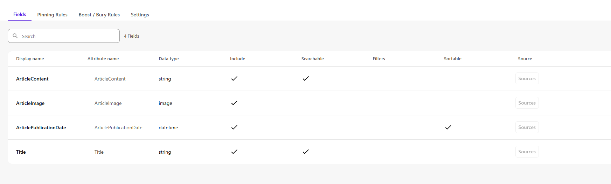

# Build a Custom Demo

> # ⚠️ Use `examples/basic-nextjs`
> **This demo builder runs on the `basic-nextjs` rendering host under `examples/`. The other
> starters in `examples/` are NOT used — ignore them.**

Turn a client's homepage (screenshot + URL) into a themed, content-filled Sitecore XM Cloud demo
on your own environment. Once setup is done, you build a demo by typing one sentence and attaching
a screenshot — the agent does the rest, pausing once for your approval before it writes anything to
Sitecore.

> **Recommended models:** for your first run, use an advanced/frontier model — **Opus**, **Fable**,
> or **Codex** — for the most reliable end-to-end result. It also works okay with Cursor's basic
> model, but you may need to make some adjustments along the way.

---

## Step 1 — Fork (or template) the repo and branch off `main`

> **⚠️ Important:** Do **not** clone this repository directly. **Fork it** or use it as a
> **template** ("Use this template" on GitHub). You only need the **`main` branch**.

```bash
# After forking / creating from template, clone YOUR copy:
git clone <your-fork-url>
cd <repo>/examples/basic-nextjs
git checkout main && git pull
git checkout -b <client>-demo
```

Use one branch per demo so each runs on its own isolated environment.

## Step 2 — Install dependencies

```bash
npm install
npx playwright install chromium
```

Verify the scraper runs (must be run from inside `examples/basic-nextjs`):

```bash
node docs/ai/scripts/site-scraper.mjs --help
```

## Step 3 — Deploy the app

- Deploy the front end to your XM Cloud rendering host.
- The deployment automatically provisions a **`main` tenant** and, under it, a **`main-website`**
  site. You do **not** need to create a new website or modify the one created during deployment —
  the agent uses that default `main-website` as-is.
- _(Optional)_ Connect a Content Hub (DAM) environment. If you provision a Content Hub instance and
  have a login, client images are uploaded there automatically. This step is optional — without it,
  images fall back to manual upload.

## Step 4 — Connect the marketer MCP

In your coding agent (e.g. Claude Code), connect the `sitecore-marketer` MCP server pointed at your
XM Cloud environment:

```
/mcp
```

If a Sitecore call later says "token expired", run `/mcp` again and retry.

## Step 5 — Add Content Hub credentials _(optional)_

Skip this step if you are not using Content Hub — images will fall back to manual upload.

```bash
cp docs/ai/config/credentials.example.yaml docs/ai/config/credentials.local.yaml
```

Edit `docs/ai/config/credentials.local.yaml` (gitignored — never committed):

```yaml
contentHub:
  host: "https://<your-instance>.sitecoresandbox.cloud/"
  authMethod: "simple"
  user: "<user>"
  password: "<password>"
  clientId: ""
  clientSecret: ""
  uploadConfig: "AssetUploadConfiguration"
```

Validate the credentials:

```bash
node docs/ai/scripts/upload-to-content-hub.mjs --images-dir docs/ai/demos/test --dry-run
# prints [auth] OK when valid
```

The file must be named `credentials.local.yaml`.

## Step 6 — Run the demo build

Ask your agent this, and **attach a full-page screenshot** of the client homepage:

```
create a custom demo for https://www.yokohama-tws.com/de-de
```

A screenshot is required — the build will not start without one. Non-English source sites are
supported; all content is translated to English automatically.

## Step 7 — Approve the plan

The agent analyzes the page and stops to ask you:

- Is the build plan correct? Approved to proceed?
- Pixel-perfect custom variants, or generic template variants?

Answer, and it continues: extract content, upload images, create and fill datasources, apply the
theme, build variants, and assemble the page.

## Step 8 — Finish the demo

When it completes, do the short manual list it hands you (in `docs/ai/demos/<client>/`):

1. Set component variants in the Pages editor (from `variant-checklist.md`).
2. Wire NavigationHeader + SiteFooter in the Header/Footer partial designs.
3. Restart the dev server / redeploy so new components load.

To view locally:

```bash
cp .env.remote.example .env.local   # fill in your XM Cloud values
npm run dev
```

---

## Enable search _(optional)_

Adds a full search experience to any custom demo: a **results page** (instant filtering, sort,
pagination, shareable `?q=` links), an auto-updating **"Latest content" strip**, a **typeahead
suggest box**, and a **search pill in the site header**. The React components ship with this repo
(`SearchResults`, `SearchCollection`, `SearchTypeahead` + the NavigationHeader search slot) — 
enabling search is configuration, not coding.

> # ⚠️ Search does NOT work in the Pages editor or Preview
> **By design, the search components never call the live search API in editing or preview mode —
> they render skeleton placeholders there. Seeing skeletons in Page Builder is normal, not
> broken.** To see search actually working you need the app running as a real rendering host:
> the **deployed site** (Vercel / XM Cloud rendering host) or **local `npm run dev`** opened
> directly at `http://localhost:3000` — not through the editor iframe.

> # ⚠️ Publishing is NOT enough — re-run the index after every content change
> **The search index is a snapshot, not a live view. Any content change — a new article, an
> updated title, a swapped image — stays invisible to search even after you publish, until you
> manually re-run the index** in Sitecore AI → Search → Configuration Manager (open the source →
> run/re-index). The order matters and both steps are required: **1) publish, 2) re-index.**
> Re-indexing before publishing re-reads the old published content and changes nothing.
> Same for deletions: a deleted article keeps appearing in results until a publish + re-index.

Full recipe and field reference: [`docs/ai/catalog/capabilities-registry.yaml`](examples/basic-nextjs/docs/ai/catalog/capabilities-registry.yaml)
(the `search` capability). Endpoint behavior and gotchas:
[`docs/ai/reference/agent-api-limitations.md`](examples/basic-nextjs/docs/ai/reference/agent-api-limitations.md) § 6.

### Step A — Prepare the content

Search shows what the index ingested, so the content template needs the fields you want on the
result cards: a title, a body/description, a date, an image — and **a URL field** (e.g.
`ArticleUrl`, Single-Line Text, filled with each page's site-relative path like
`/Articles/My-Article`). Indexes have no URL attribute by default; without this field, result
cards render without links. Ask your agent to add and fill it if the demo content doesn't have one.

Then **publish** — the index only sees published content.

### Step B — Create the search source (Sitecore AI UI)

In **Sitecore AI → Search → Configuration Manager**, create a source over your content. On the
field-configuration screen:

- **Include** every field the cards need (title, description, image, date, URL field).
- Mark the title and description **Searchable** (what the keyphrase matches against).
- Mark the date field **Sortable** (powers the sort control and the "latest" strip).
- Do **not** mark the URL field Searchable (URL text would pollute matching).

The source's Fields tab should end up looking like this (articles example):



> ⚠️ A source's field set is **fixed at creation** — fields added to the template later never
> appear in an existing index. If you need another field, create a new source and repoint the
> datasource items to its GUID.

Run the index, then copy the **index GUID** from the index details (also visible in the index URL).

### Step C — Create the Sitecore items (agent)

Ask your agent, giving it the GUID and your field names:

```
Enable search for this demo. Index GUID: <guid>.
Map title=<TitleField>, description=<BodyField>, image=<ImageField>,
link=<UrlField>, date=<DateField>. Results page: <page>.
```

Following the capabilities registry, the agent creates the datasource templates/renderings (first
time only), one datasource item per component with your index GUID + attribute mappings, places
the components (results page + strip), and wires the **header search** via the NavigationHeader
datasource's `Search` section (leave its `SearchIndex` empty for no header search).

Any mapping you leave empty degrades gracefully — cards simply render without that element.

### Step D — Verify

```bash
cd examples/basic-nextjs

# HTTP boundary: dumps the exact attribute names + documents the index returns
node docs/ai/scripts/search-probe.mjs <index-guid> [keyphrase]

# Browser protocols (dev server running):
node docs/ai/scripts/search-verify.mjs      # results page
node docs/ai/scripts/collection-verify.mjs  # latest-content strip
node docs/ai/scripts/typeahead-verify.mjs   # typeahead + ?q= handoff
```

The browser scripts assert this repo's built-in articles corpus — for a different vertical, ask
the agent to adapt the expected titles/queries (a few lines at the top of each script).

If something looks off, probe first — no-result queries usually mean unpublished content or a
stale index, and the probe shows the real attribute names to use in the mappings. Note the index
refreshes on publish + re-run, and keyphrase matching is loose (multi-word queries match partial
words — the expected document ranks first rather than being the only hit).